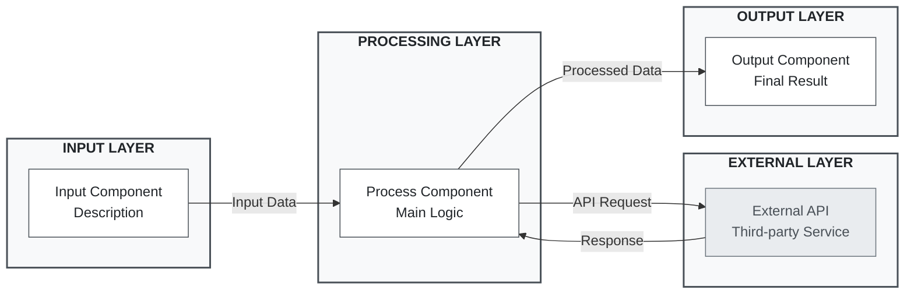

# Mermaid Corporate Minimalist Style Guide

## Overview
Professional, grayscale Mermaid diagrams for enterprise environments. Prioritizes clarity, accessibility, and timeless aesthetics.

## Design Principles
- Form follows function
- High contrast (4.5:1 minimum)
- No decorative elements
- Consistent visual language

## Color Palette

| Element | Color | Usage |
|---------|-------|-------|
| **Text Primary** | `#212529` | Headers, main content |
| **Text Secondary** | `#495057` | Labels, descriptions |
| **Text Tertiary** | `#6c757d` | Supporting text |
| **Component Fill** | `#ffffff` | Main components |
| **Layer Fill** | `#f8f9fa` | Subgraph backgrounds |
| **External Fill** | `#e9ecef` | Third-party services |
| **Border Primary** | `#495057` | Component borders |
| **Border Secondary** | `#6c757d` | External borders |

## Styles

```mermaid
// Layer containers
classDef layerStyle fill:#f8f9fa,stroke:#495057,stroke-width:2px,color:#212529,font-weight:bold

// Main components  
classDef componentStyle fill:#ffffff,stroke:#495057,stroke-width:1px,color:#212529

// External services
classDef externalStyle fill:#e9ecef,stroke:#6c757d,stroke-width:1px,color:#495057
```

## Connections

```mermaid
A -->|"Primary"| B     // Solid arrows
A -.->|"Optional"| B   // Dashed for fallback
A <-->|"Exchange"| B   // Bidirectional
```

## Labeling

### Components
- **Format**: `"Primary Name<br/>Description"`
- **Style**: Title Case for names, sentence case for descriptions

### Layers
- **Format**: `"LAYER NAME"` (ALL CAPS)
- **Examples**: `"INPUT LAYER"`, `"PROCESSING LAYER"`

### Connections
- **Brief phrases** in quotes
- **Examples**: `"API Request"`, `"Processed Data"`

## Layout

- **Direction**: LR (left-to-right) for processes, TD for hierarchies
- **Grouping**: Logical layers using subgraphs
- **Flow**: Sequential progression

## Template



## Use Cases
- System architecture diagrams
- Business process flows
- Data flow documentation
- API integration diagrams
- Executive presentations

## Checklist

- [ ] Grayscale only (no colors)
- [ ] 4.5:1 contrast ratio minimum
- [ ] ALL CAPS layer labels
- [ ] Title Case component names
- [ ] Labeled connections
- [ ] Logical grouping
- [ ] Professional terminology