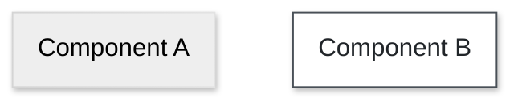
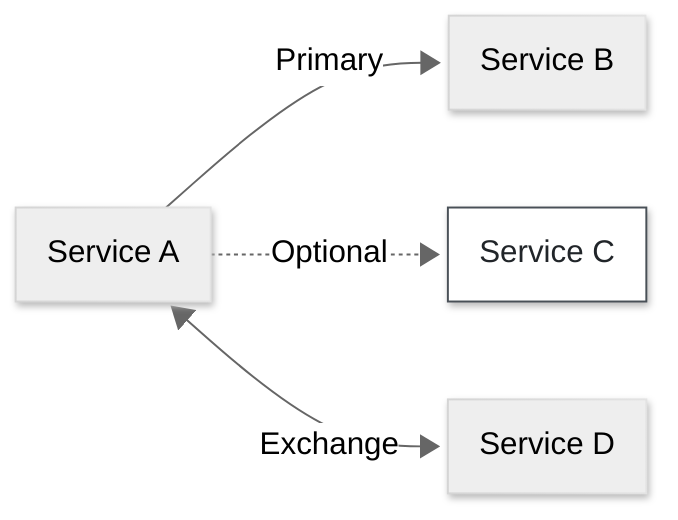
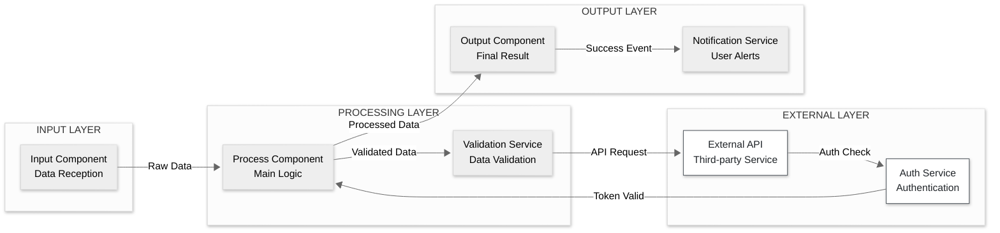
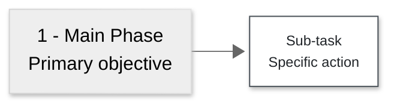
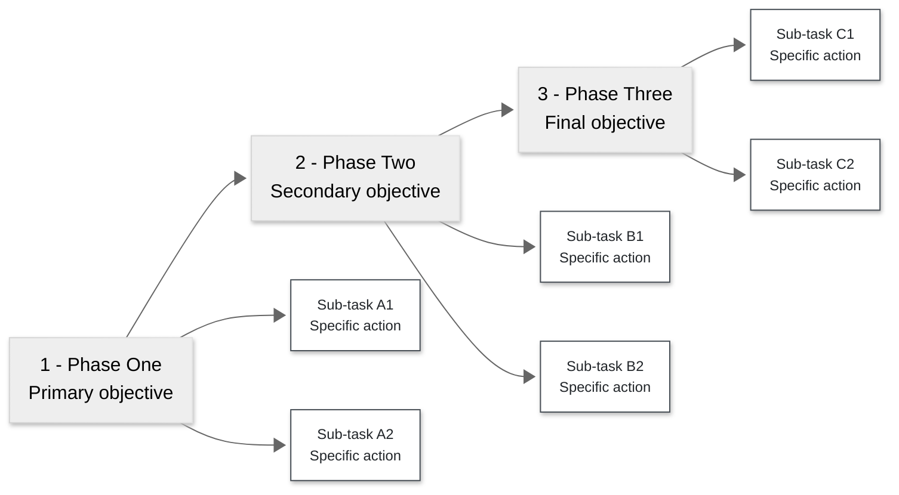
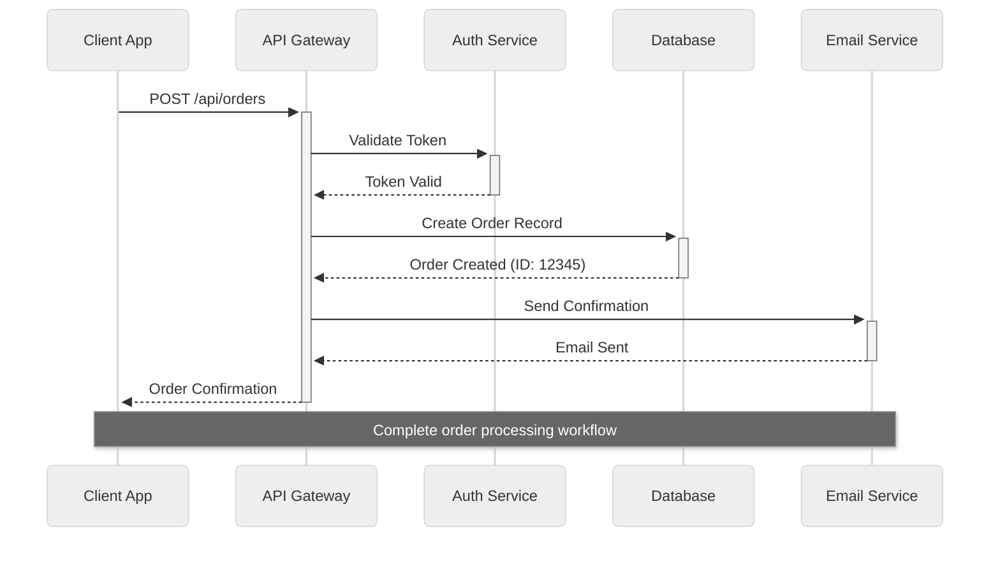
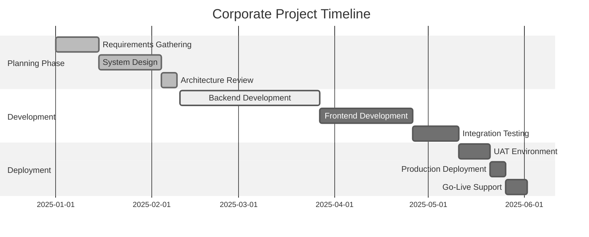
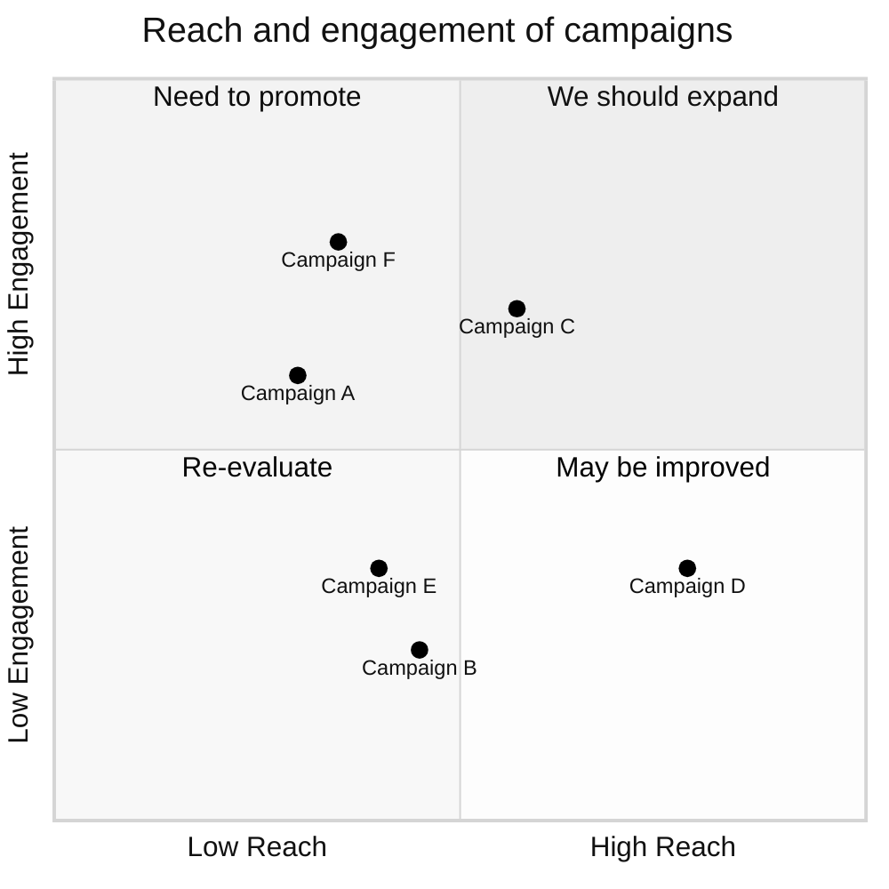

# Mermaid Corporate Minimalist Style Guide

## Overview

This style guide establishes standardized visual conventions for creating professional Mermaid diagrams in corporate and enterprise environments. The framework emphasizes clarity, accessibility, and timeless design principles that ensure diagrams remain effective across diverse business contexts and stakeholder audiences.

## Table of Contents
1. [Design Principles](#design-principles)
2. [AI System Guidelines](#ai-system-guidelines)
3. [Configuration](#configuration)
4. [Labeling](#labeling)
5. [Layout](#layout)
6. Diagrams
   1. [System Architecture Diagrams](#system-architecture-diagrams)
   2. [System Component Flow Diagrams](#system-component-flow-diagrams)
   3. [Lineage/Process Flow Diagrams](#lineageprocess-flow-diagrams)
   4. [System Integration Sequence Diagrams](#system-integration-sequence-diagrams)
   5. [Project Management Gantt Charts](#project-management-gantt-charts)
   6. [Strategic Analysis Quadrant Charts](#strategic-analysis-quadrant-charts)
7. [References](#references)

## Design Principles
- Form follows function
- High contrast (4.5:1 minimum)
- No decorative elements
- Consistent visual language

### Purpose and Scope

Organizations require consistent visual documentation that communicates complex technical and business concepts effectively. This guide addresses the need for:

- **Standardization**: Uniform visual language across teams and departments
- **Accessibility**: High-contrast designs meeting WCAG compliance standards
- **Professionalism**: Clean, minimalist aesthetics appropriate for executive presentations
- **Versatility**: Templates adaptable to various diagram types and use cases
- **Maintenance**: Timeless design choices that avoid frequent style updates

### Target Applications

The style guide supports comprehensive enterprise documentation needs:

- **Technical Architecture**: System designs, service integrations, and infrastructure documentation
- **Business Process**: Workflow documentation, process optimization, and operational procedures
- **Project Management**: Timeline visualization, milestone tracking, and strategic planning
- **Executive Communication**: High-level overviews suitable for leadership presentations

### Design Philosophy

Built on the principle that form follows function, this approach prioritizes information clarity over decorative elements. The neutral color palette and consistent typography ensure diagrams remain readable in various contexts, from printed reports to digital presentations, while maintaining professional credibility across all organizational levels.

## AI System Guidelines

When asked to "format documentation to this style" or "apply this style guide":

### Assessment Protocol
**ALWAYS assess first:**
1. **Purpose**: Does the existing content require visualization to be understood?
2. **Complexity**: Are there multiple interconnected concepts that would benefit from visual representation?
3. **User Intent**: Did the user explicitly request diagrams, or are they asking for formatting/styling?

### When to Create Diagrams

**Create diagrams ONLY when:**
- The user explicitly requests diagram creation
- Content contains complex workflows, system architectures, or process flows that would genuinely benefit from visualization
- Visualizing complex processes with 3+ steps or decision points
- Showing relationships between multiple systems or components
- Presenting workflows to stakeholders who need visual context
- Documenting technical architecture with interconnected services
- Illustrating data flow or process sequences that are difficult to describe in text
- Creating executive summaries that require high-level visual overviews

**DO NOT create diagrams for:**
- Simple concepts that are clearer as text (e.g., single-step processes)
- Formatting existing clear documentation that doesn't need visualization
- Adding decorative visual elements to content
- Replacing well-written prose with unnecessary flowcharts
- Creating diagrams when the text explanation is already sufficient
- Documentation where diagrams would add complexity rather than clarity

### Decision Framework
Before creating a diagram, ask:
1. **Complexity**: Does this concept have multiple interconnected parts?
2. **Audience**: Would stakeholders benefit from visual representation?
3. **Clarity**: Does a diagram make this concept easier to understand?
4. **Value**: Does the diagram serve a functional purpose beyond decoration?

If the answer to most questions is "no," stick to well-formatted text.

### Application Rules
**Default behavior**: Apply only the design principles (neutral theme, clean formatting, consistent typography) WITHOUT generating visual content.

### Reference Usage
**The examples in sections 6-11 are reference implementations, NOT templates to automatically apply:**
- Use them as guidance when diagram creation is appropriate
- Do not default to generating diagrams based on these examples
- Ask clarifying questions if the user's intent is unclear

### Recommended Responses
Instead of immediately generating diagrams, consider responses like:
- "I can apply the neutral theme and formatting principles. Would you also like me to create diagrams for any specific processes or systems?"
- "This content could benefit from [specific diagram type]. Should I create one, or would you prefer just the text formatting?"

## Configuration

All diagrams use the following Mermaid configuration for consistent styling:

```yaml
config:
  look: neo
  theme: neutral
```

This provides a professional, minimalist appearance with:
- Clean geometric shapes
- Neutral color scheme from the theme
- Consistent typography and spacing

## Labeling

### Components
- **Format**: `"Primary Name<br/>Description"`
- **Style**: Title Case for names, sentence case for descriptions

### Layers
- **Format**: `"LAYER NAME"` (ALL CAPS)
- **Examples**: `"INPUT LAYER"`, `"PROCESSING LAYER"`

### Connections
- **Brief phrases** in quotes
- **Examples**: `"API Request"`, `"Processed Data"`

## Layout

- **Direction**: LR (left-to-right) for processes, TD for hierarchies
- **Grouping**: Logical layers using subgraphs
- **Flow**: Sequential progression

## System Architecture Diagrams

For cloud infrastructure and service relationships:

### Design Pattern
- **Service grouping**: Logical grouping of related services and resources
- **Icon representation**: Clear visual icons for different service types
- **Connection mapping**: Directional relationships between services
- **Cloud-focused**: Optimized for cloud and CI/CD deployment visualization

### Icon Selection
Mermaid architecture diagrams support multiple icon sources:

**Default Icons**: `cloud`, `database`, `disk`, `internet`, `server`

**Logo Libraries**: 
- `logos:` prefix for service logos (e.g., `logos:aws`, `logos:aws-s3`)
- `mdi:` prefix for Material Design icons (e.g., `mdi:users`, `mdi:account`)

**Finding Icons**: Browse available icons at [iconify.design](https://iconify.design) - search by service name or icon type. Common patterns:
- AWS services: `logos:aws-[service-name]`
- Material Design: `mdi:[icon-name]`
- Technology logos: `logos:[technology-name]`

### Reference Implementation


```mermaid
---
config:
  look: neo
  theme: neutral
---
architecture-beta
    group internet(internet)[Internet]
    service users(mdi:users)[Users] in internet
    
    group aws_cloud(logos:aws)[AWS Cloud]

    service s3_bucket(logos:aws-s3)[S3 Static Hosting] in aws_cloud
    service api_gateway(logos:aws-api-gateway)[API Gateway] in aws_cloud
    service lambda_function(logos:aws-lambda)[Lambda Function] in aws_cloud
    service dynamodb(logos:aws-dynamodb)[DynamoDB] in aws_cloud
    service cloudfront(logos:aws-cloudfront)[CloudFront CDN] in aws_cloud
    
    users:R --> L:cloudfront
    cloudfront:R --> L:s3_bucket
    cloudfront:B --> T:api_gateway
    api_gateway:R --> L:lambda_function
    lambda_function:R --> L:dynamodb
```

## System Component Flow Diagrams

For system architecture with layered components and data flow between services:

### Design Pattern
- **Layered architecture**: Logical grouping using subgraphs
- **Data flow**: Left-to-right progression through system layers
- **Component types**: Input, processing, external services, output
- **Integration**: Clear API request/response patterns

### Styles

For system component diagrams, use these class definitions:



### Connections

Connection types for system component diagrams:



### Reference Implementation


## Lineage/Process Flow Diagrams

For sequential processes with hierarchical detail tasks, use the lineage pattern:

### Design Pattern
- **Main timeline**: Horizontal flow with numbered phases
- **Branches**: Vertical branches from each main phase
- **Numbering**: Use "1 - ", "2 - " format to avoid markdown conflicts
- **Hierarchy**: Two levels maximum for clarity

### Styling Classes


### Reference Implementation


### Best Practices
- Keep branches to 2-5 items per main phase
- Use consistent labeling: "Primary Name<br/>Description"
- Avoid deep nesting (max 2 levels)
- Maintain visual balance across branches

## System Integration Sequence Diagrams

For API workflows and service interactions with temporal flow:

### Design Pattern
- **Participant flow**: Clear service interactions over time
- **Message types**: Synchronous (->>) and asynchronous (-->>)
- **Activation**: Show service processing time with +/-
- **Notes**: Contextual information for complex workflows

### Reference Implementation


## Project Management Gantt Charts

For project timelines and milestone tracking:

### Design Pattern
- **Phase grouping**: Logical project phases as sections
- **Status indicators**: done, active, future states
- **Dependencies**: Sequential task relationships
- **Professional dates**: Clear YYYY-MM-DD format

### Reference Implementation


## Strategic Analysis Quadrant Charts

For portfolio analysis and strategic decision-making:

### Design Pattern
- **Two-dimensional analysis**: X and Y axis with meaningful metrics
- **Quadrant labels**: Clear strategic recommendations for each quadrant
- **Data plotting**: Precise coordinate positioning for analysis items
- **Professional titles**: Business-focused axis and chart titles

### Reference Implementation


## References

[1] Mermaid Documentation. *Sequence Diagrams*. Retrieved from https://mermaid.js.org/syntax/sequenceDiagram.html

[2] Mermaid Documentation. *Flowcharts*. Retrieved from https://mermaid.js.org/syntax/flowchart.html

[3] Mermaid Documentation. *Gantt Charts*. Retrieved from https://mermaid.js.org/syntax/gantt.html

[4] Mermaid Documentation. *Quadrant Charts*. Retrieved from https://mermaid.js.org/syntax/quadrantChart.html

[5] Mermaid Documentation. *Themes and Configuration*. Retrieved from https://mermaid.js.org/config/theming.html

[6] Mermaid Documentation. *Configuration*. Retrieved from https://mermaid.js.org/config/configuration.html

[7] Mermaid Documentation. *Architecture Diagrams*. Retrieved from https://mermaid.js.org/syntax/architecture.html

[8] Iconify Design. *Icon Sets*. Retrieved from https://iconify.design