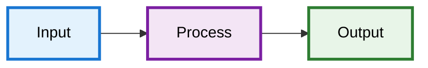

# Mermaid Style Guide - Material Design Colors

## Overview
Material Design-based color palette for consistent, accessible Mermaid diagrams using light pastel fills with darker borders.

## Color Palette

```mermaid
// Core Components
classDef inputStyle fill:#e3f2fd,stroke:#1976d2,stroke-width:3px,color:#000
classDef processStyle fill:#f3e5f5,stroke:#7b1fa2,stroke-width:3px,color:#000
classDef aiStyle fill:#fce4ec,stroke:#c2185b,stroke-width:3px,color:#000
classDef outputStyle fill:#e8f5e8,stroke:#2e7d32,stroke-width:3px,color:#000
classDef externalStyle fill:#fff3e0,stroke:#f57c00,stroke-width:2px,color:#000

// Extended Palette
classDef securityStyle fill:#ffebee,stroke:#d32f2f,stroke-width:3px,color:#000
classDef databaseStyle fill:#e8f5e8,stroke:#388e3c,stroke-width:3px,color:#000
classDef networkStyle fill:#e1f5fe,stroke:#0288d1,stroke-width:3px,color:#000
classDef configStyle fill:#f9fbe7,stroke:#689f38,stroke-width:3px,color:#000
classDef monitoringStyle fill:#fff8e1,stroke:#ffa000,stroke-width:3px,color:#000
classDef neutralStyle fill:#fafafa,stroke:#616161,stroke-width:2px,color:#000
```

## Color Assignments

| Type | Color | Use Case |
|------|-------|----------|
| **Input** | Blue | User inputs, CLI, forms |
| **Process** | Purple | Main logic, engines |
| **AI** | Pink | ML, AI services |
| **Output** | Green | Results, success states |
| **External** | Orange | APIs, third-party |
| **Security** | Red | Auth, security |
| **Database** | Dark Green | Storage, persistence |
| **Network** | Light Blue | Communication |
| **Config** | Lime | Settings, parameters |
| **Monitor** | Amber | Metrics, logging |

## Style Rules

- **Fill**: 50-100 shade (light)
- **Border**: 700 shade (dark)
- **Text**: Black (`#000`)
- **Width**: 3px primary, 2px secondary
- **Max colors**: 5-6 per diagram

## Connections

```mermaid
A --> B        // Primary flow
A -.-> B       // Optional flow
A <--> B       // Bidirectional
A ==> B        // Emphasis
A -->|"Label"| B  // Labeled
```

## Template



## Checklist

- [ ] Max 5-6 colors used
- [ ] Consistent color meanings
- [ ] 4.5:1 contrast ratio
- [ ] Valid Mermaid syntax